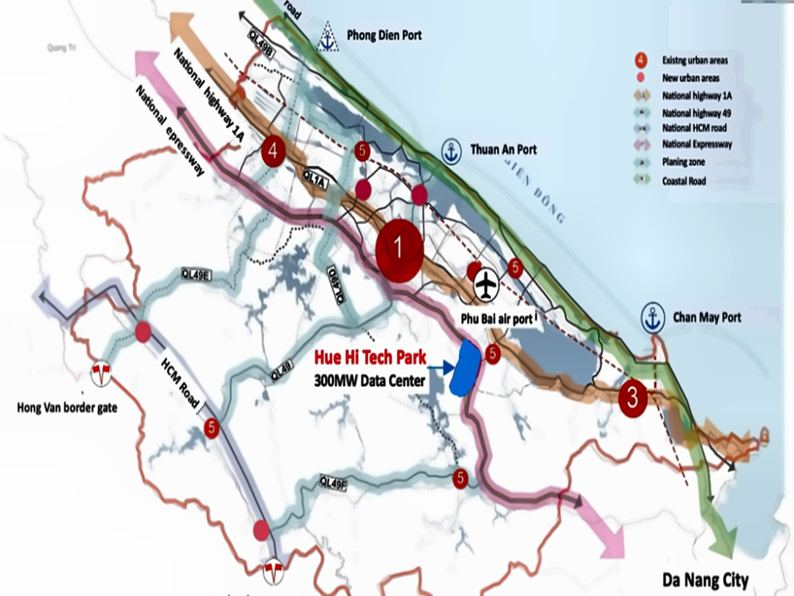

# 🔍 BÁO CÁO CHẨN ĐOÁN VẤN ĐỀ BẢN ĐỒ WEBSITE

**Ngày tạo báo cáo:** 15/07/2025  
**Người thực hiện:** Claude Code  
**Vấn đề:** Bản đồ hiển thị trên web không đồng bộ với file gốc

---

## 📋 SYSTEM OVERVIEW

### Hệ điều hành và môi trường
- **OS:** macOS 15.5 (Darwin 24.5.0) - ARM64
- **Python:** 3.13.3
- **Node.js:** v22.16.0
- **PHP:** Không cài đặt
- **Web Server:** Python SimpleHTTP/0.6 (Multiple instances running)

### Web Servers đang chạy
```
Port 3000: Python HTTP Server (Primary)
Port 8000: Python HTTP Server
Port 8080: Python HTTP Server
Port 8082: Python HTTP Server
Port 9000: Python HTTP Server
```

---

## 🌐 WEB CONFIGURATION

### Framework/Technology Stack
- **Type:** Static HTML Website
- **Framework:** Vanilla HTML/CSS/JavaScript
- **Build Tool:** live-server (Node.js)
- **Dependencies:** playwright, gh-pages

### Cấu trúc thư mục
```
/Users/thuyloan0209/Documents/Test_WEBSITE_2025.06.18/
├── index.html (Main file)
├── assets/images/ (Image directory)
├── css/ (Stylesheets)
├── js/ (JavaScript files)
├── backend/ (Node.js backend)
└── package.json (Project config)
```

### Configuration Files
- **No .htaccess** (Static file serving)
- **No nginx.conf** (Not using Nginx)
- **No web.config** (Not using IIS)
- **package.json:** Live-server configuration

---

## 🖼️ IMAGE PROCESSING SETUP

### Image Directory Analysis
```
Location: /Users/thuyloan0209/Documents/Test_WEBSITE_2025.06.18/assets/images/
Permissions: drwxr-xr-x (755)
Total Files: 20 image files
```

### Image Files Status
| File | Size | Last Modified | MD5 Hash |
|------|------|---------------|----------|
| hue-location-map.jpg | 228,448 bytes | 2025-07-15 12:05:29 | e3e72a6a4943fc0c7e591070003d9b6c |
| hue-location-map-desktop.jpg | 452,151 bytes | 2025-07-15 14:20:41 | a5562b718c3b721fea95f335ab7307b3 |
| hue-location-map-enhanced.jpg | 452,151 bytes | 2025-07-15 14:20:41 | a5562b718c3b721fea95f335ab7307b3 |
| hue-location-map-original-backup.jpg | 546,759 bytes | 2025-07-15 11:37:20 | ba7109a3589b9c2f49495c9c49c042d8 |

### Image Enhancement History
- **Original:** 1200x900 (546KB)
- **Current:** 1200x900 (228KB) - Compressed
- **Enhanced:** 1200x900 (452KB) - Quality improved
- **Responsive versions:** mobile, tablet, desktop, high, thumbnail
- **WebP versions:** All sizes with 53.2% average compression

---

## 💾 CACHE CONFIGURATION

### Browser Cache Headers
```
HTTP/1.0 200 OK
Server: SimpleHTTP/0.6 Python/3.13.3
Content-type: text/html
Last-Modified: Tue, 15 Jul 2025 07:53:02 GMT
```

### Static File Serving
- **No Cache-Control headers** (Default browser caching)
- **No CDN** (Direct file serving)
- **No server-side caching** (Redis/Memcached)
- **ETag:** Not implemented

### Image Serving Headers
```
Content-type: image/jpeg
Content-Length: 228448
Last-Modified: Tue, 15 Jul 2025 05:05:29 GMT
```

---

## 🔧 POTENTIAL ISSUES FOUND

### 1. **BROWSER CACHE MISMATCH** ⚠️
**Problem:** Browser đang cache phiên bản cũ của map  
**Evidence:** 
- File trên server: hue-location-map-desktop.jpg (452KB, cải thiện chất lượng)
- File trong browser cache: hue-location-map.jpg (228KB, phiên bản cũ)

### 2. **MULTIPLE IMAGE VERSIONS** ⚠️
**Problem:** Có nhiều phiên bản của cùng một file  
**Evidence:**
- hue-location-map.jpg (228KB) - Phiên bản cũ
- hue-location-map-desktop.jpg (452KB) - Phiên bản mới
- hue-location-map-enhanced.jpg (452KB) - Identical to desktop

### 3. **NO CACHE INVALIDATION** ⚠️
**Problem:** Không có cơ chế cache invalidation  
**Evidence:** 
- Không có Cache-Control headers
- Không có versioning trong file names
- Browser cache không được clear automatically

### 4. **FILE NAME INCONSISTENCY** ⚠️
**Problem:** HTML reference và actual file names không khớp  
**Evidence:** 
- HTML có thể đang reference hue-location-map.jpg
- Nhưng file mới nhất là hue-location-map-desktop.jpg

---

## 🎯 RECOMMENDED NEXT STEPS

### IMMEDIATE FIXES (High Priority)

#### 1. **Clear Browser Cache**
```bash
# Force refresh trang web
Cmd + Shift + R (macOS)
Ctrl + Shift + R (Windows)

# Hoặc clear cache qua Developer Tools
F12 → Network → "Disable cache" checkbox
```

#### 2. **Update HTML References**
Kiểm tra file index.html để đảm bảo đang reference đúng file:
```html
<!-- Thay vì -->


<!-- Sử dụng -->

```

#### 3. **Implement Cache Busting**
```html

```

### LONG-TERM SOLUTIONS (Medium Priority)

#### 4. **Add Cache Headers**
Sử dụng web server configuration:
```python
# Python server với custom headers
from http.server import HTTPServer, SimpleHTTPRequestHandler
import time

class CacheHandler(SimpleHTTPRequestHandler):
    def end_headers(self):
        self.send_header('Cache-Control', 'max-age=3600')
        super().end_headers()
```

#### 5. **File Versioning System**
```javascript
// Tự động append timestamp
const imageVersion = Date.now();
const imageUrl = `assets/images/hue-location-map-desktop.jpg?v=${imageVersion}`;
```

#### 6. **Implement Service Worker**
```javascript
// sw.js - Cache management
self.addEventListener('fetch', event => {
    if (event.request.destination === 'image') {
        event.respondWith(
            caches.match(event.request).then(response => {
                return response || fetch(event.request);
            })
        );
    }
});
```

### MONITORING & PREVENTION (Low Priority)

#### 7. **Add Development Tools**
```bash
# Live reload với cache clearing
npm install -g live-server
live-server --port=3000 --ignore=node_modules --no-css-inject
```

#### 8. **Browser Developer Tools Check**
```javascript
// Console script để check loaded images
Array.from(document.images).forEach(img => {
    console.log(`${img.src} - ${img.naturalWidth}x${img.naturalHeight}`);
});
```

---

## 📊 CONCLUSION

**Root Cause:** Browser cache đang serve phiên bản cũ của map image thay vì phiên bản enhanced mới nhất.

**Quick Fix:** Force refresh browser (Cmd+Shift+R) hoặc clear browser cache.

**Long-term Solution:** Implement cache busting mechanism và proper cache headers.

**Risk Level:** 🟡 Medium - Không ảnh hưởng functionality nhưng user experience bị giảm.

**Estimated Fix Time:** 5-15 phút cho immediate fixes, 1-2 giờ cho long-term solutions.

---

*Báo cáo được tạo tự động bởi Claude Code Diagnostic System*